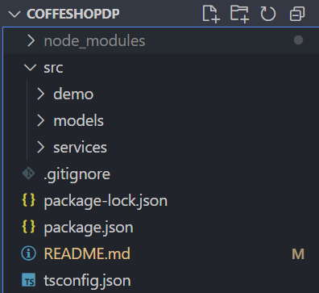

# Système de Gestion de Café 

Un système complet pour gérer les commandes de café, les personnalisations et l'inventaire, implémentant plusieurs design patterns clés.

## Fonctionnalités

- Commandes de café avec personnalisations
- Gestion d'inventaire en temps réel
- Historique des commandes

## Design Patterns Implémentés

### 1. Singleton (InventoryManager)
Garantit une seule instance du gestionnaire d'inventaire dans toute l'application.

### 2. Factory 
La création des différents types de cafés (Espresso, Latte) sans exposer la logique d'instanciation au code client.

### 3. Pattern Decorator 
Ajouter dynamiquement des personnalisations (lait, sucre) sans modifier la structure de base des cafés.

## Diagramme de classes:

## Structure du projet:
